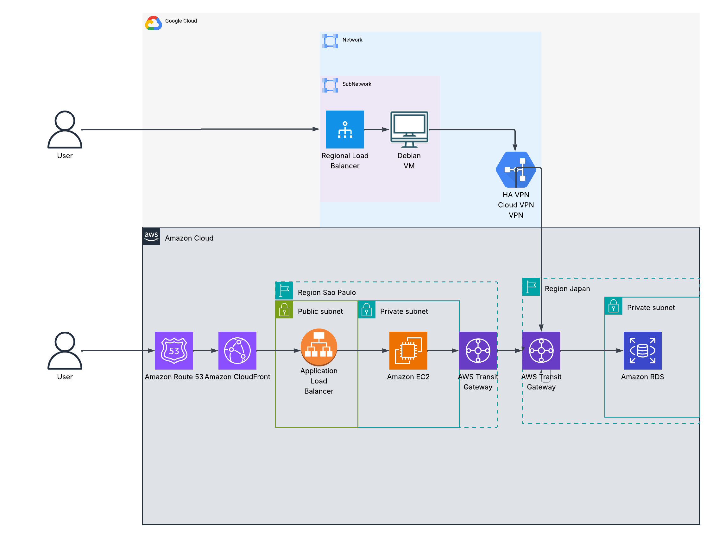
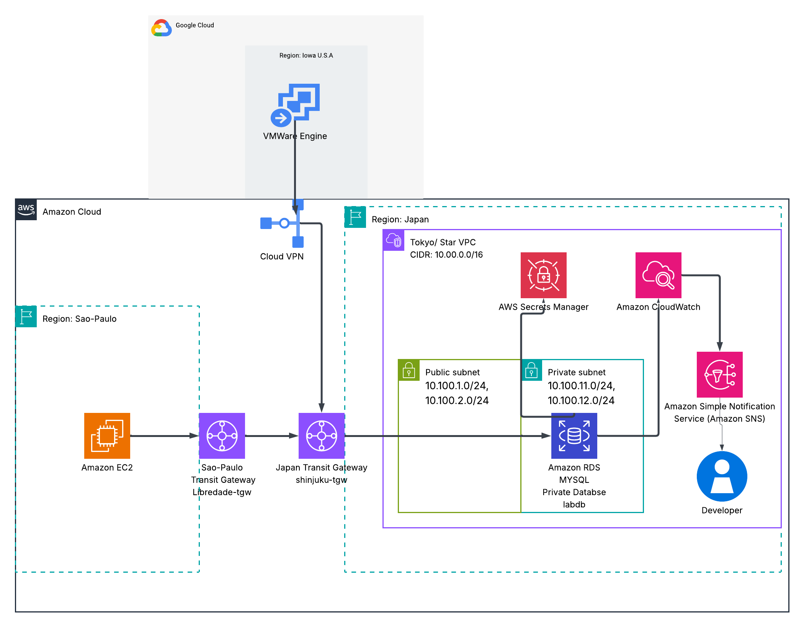
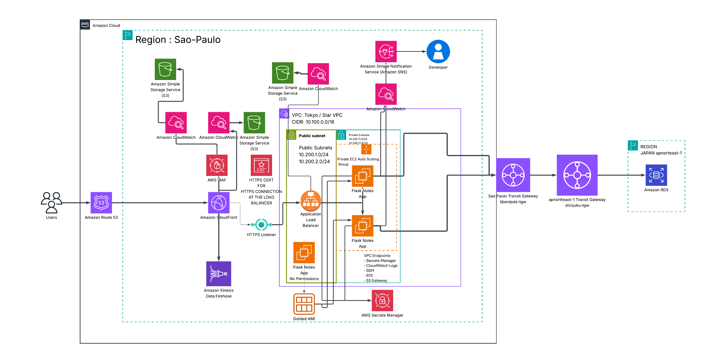
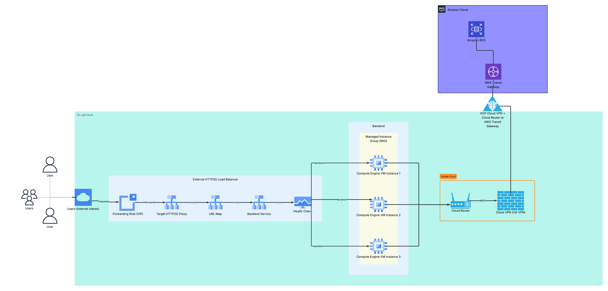

# 🏥 Armageddon: Secure Multi-Cloud Medical Application Platform with Japan-Resident Database Connectivity

<p align="center">
  
</p>

<p align="center">
  A production-inspired multi-cloud medical application infrastructure project for a Japanese organization that proves private application-to-database connectivity across AWS and GCP using Terraform, Transit Gateway, HA VPN, BGP, private routing, load balancing, security controls, observability, and evidence-driven validation while keeping the primary medical data layer anchored in AWS Tokyo.
</p>

<p align="center">
  
  
  
  
  
</p>

<p align="center">
  
  
  
  
  
</p>

<p align="center">
  
  
  
  
  
</p>

<p align="center">
  
  
  
  
  
</p>

---

## 📋 Table of Contents

* [📌 Project Objective](#-project-objective)
* [🧠 Problem Statement](#-problem-statement)
* [🏗️ Architecture](#️-architecture)
* [📊 Architecture Diagrams](#-architecture-diagrams)
* [🖥️ Project Overview](#️-project-overview)
* [🎥 Demo Videos](#-demo-videos)
* [🧰 Technology Stack](#-technology-stack)
* [☁️ Cloud Services Used](#️-cloud-services-used)
* [📁 Project Structure](#-project-structure)
* [🚀 Quick Start](#-quick-start)
* [⚙️ Implementation Summary](#️-implementation-summary)
* [🔐 Security Architecture](#-security-architecture)
* [🌐 Network Architecture](#-network-architecture)
* [🗄️ Database Architecture](#️-database-architecture)
* [🧪 Validation and Testing](#-validation-and-testing)
* [🛡️ Pentesting and Security Assessment](#️-pentesting-and-security-assessment)
* [📊 Observability](#-observability)
* [🔁 CI/CD Pipeline Simulation](#-cicd-pipeline-simulation)
* [🏢 Enterprise Architecture Mapping](#-enterprise-architecture-mapping)
* [⚖️ Scaling Considerations](#️-scaling-considerations)
* [🧩 Multi-Service Expansion](#-multi-service-expansion)
* [📸 Evidence Pack](#-evidence-pack)
* [🧹 Teardown](#-teardown)
* [🧠 Lessons Learned](#-lessons-learned)
* [🧪 Troubleshooting Highlights](#-troubleshooting-highlights)
* [📚 References](#-references)
* [👥 Author](#-author)
---

## 📌 Project Objective

The objective of this project was to build and validate a secure, multi-cloud medical application platform for a Japanese organization operating under strict data protection, privacy, and data residency expectations.

This project proves that separate application environments can operate across multiple regions and cloud providers while privately connecting back to a centralized Amazon RDS MySQL database hosted in Tokyo, Japan.

In this architecture, AWS Tokyo acts as the primary Japan-resident medical data environment. AWS São Paulo and GCP Iowa operate as distributed medical application access layers that connect back to the Tokyo database through controlled private network paths.

The project is designed around an APPI-aligned infrastructure concept. Sensitive medical application data remains anchored in Japan, the database is never exposed directly to the public internet, access paths are controlled through private routing and security groups, and cross-cloud connectivity is validated through evidence.

The final architecture demonstrates:

* AWS Tokyo as the central private medical database and transit hub
* AWS São Paulo as a regional medical application environment
* GCP Iowa as a separate cross-cloud medical application environment
* Japan-centered data residency for the primary database layer
* APPI-aligned private data access architecture
* Private cross-cloud database connectivity
* AWS Transit Gateway routing
* Inter-region Transit Gateway peering
* GCP HA VPN connectivity into AWS
* BGP route exchange
* Private subnet compute for application workloads
* Public load-balanced application entry points
* CloudFront, WAF, Route 53, and HTTPS exposure
* Terraform-driven infrastructure deployment
* Evidence-based validation and security assessment
---

## 🧠 Problem Statement

Japanese healthcare organizations need to modernize medical applications without weakening control over sensitive patient data, private infrastructure, or regulatory expectations.

A realistic medical platform may need to support:

* Regional application access
* Cross-cloud infrastructure integration
* Private access to centralized patient records
* Secure application delivery over HTTPS
* Medical data protection and access control
* Evidence that patient data is not exposed publicly
* Operational proof that routing, security groups, secrets, and database access are working as designed

The challenge is not just deploying a web application.

The challenge is proving that a distributed medical application can operate across cloud providers while keeping the system of record anchored in Japan.

```text
Patient / Clinical User
→ Secure HTTPS Entry Point
→ Regional Medical Application
→ Private Compute Layer
→ Private Cross-Cloud Network Path
→ Japan-Resident Medical Database
→ Logging, Monitoring, and Security Evidence
```
---

## 🏗️ Architecture

At a high level, this platform is built around three major environments.

| Environment | Cloud | Region | Purpose |
|---|---|---|---|
| Tokyo / Japan | AWS | `ap-northeast-1` | Japan-resident medical database, Transit Gateway hub, VPN termination, and patient data authority |
| São Paulo / Brazil | AWS | `sa-east-1` | Regional medical application stack with a secure public entry point |
| Iowa / United States | GCP | `us-central1` | Cross-cloud medical application stack connected to AWS Tokyo through HA VPN and BGP |

The medical database authority lives in AWS Tokyo.

Application workloads in AWS São Paulo and GCP Iowa connect back to the Tokyo database over private network paths. This design keeps the patient data system of record anchored in Japan while proving that distributed medical application environments can securely operate across multiple regions and cloud providers.

---

## 📊 Architecture Diagrams

### Global Architecture



### AWS Japan / Tokyo Architecture



### AWS São Paulo Architecture



### GCP Iowa Architecture



---

## 🖥️ Project Overview

This project deploys a stateful medical web application architecture where application servers can create, read, and validate records stored in a private Amazon RDS MySQL database hosted in AWS Tokyo.

The project is framed as a medical application platform for a Japanese organization that needs Japan-centered data residency, controlled cross-border access, and clear evidence that the database is not publicly reachable.

This is more than a web application. It is a complete healthcare infrastructure engineering build that combines cloud networking, secure database access, private routing, multi-cloud connectivity, Terraform state handoff, edge protection, application validation, observability, evidence generation, and controlled security testing.

The application layer validates that the infrastructure is not theoretical. It proves the network path by writing and reading medical application data through the private Japan-hosted database connection.

---

## 🎥 Demo Videos

This section provides visual proof of the deployed multi-cloud architecture in action.  
The recordings demonstrate live application connectivity across cloud providers, regions, and private network paths, validating that the AWS, GCP, and Japan database components were successfully integrated.

### AWS São Paulo to Japan

This demo validates connectivity from the AWS São Paulo application layer to the Japan-hosted database environment.  
It confirms that the application can reach the backend database over the intended cloud network path and that the cross-region AWS architecture is functioning correctly.

https://github.com/user-attachments/assets/2ea12e3b-d528-4f82-ae48-b46c005f5ae9

### GCP Iowa to Japan

This demo validates connectivity from the GCP Iowa application layer to the Japan-hosted database environment.  
It confirms that the GCP workload can communicate with the AWS-hosted database over the configured hybrid cloud path, proving the multi-cloud routing and private connectivity design.

https://github.com/user-attachments/assets/d70e02f6-f842-4fad-92d9-9ec6975027d4


## 🧰 Technology Stack

| Layer | Technology |
|---|---|
| Infrastructure as Code | Terraform |
| Cloud Provider 1 | AWS |
| Cloud Provider 2 | Google Cloud Platform |
| AWS Regions | Tokyo / `ap-northeast-1`, São Paulo / `sa-east-1` |
| GCP Region | Iowa / `us-central1` |
| Compute | EC2, Auto Scaling Group, GCP Managed Instance Group |
| Application | Python Flask |
| Database | Amazon RDS MySQL |
| Networking | VPC, Subnets, Route Tables, Transit Gateway, HA VPN, BGP |
| Edge | CloudFront, Route 53, ACM, Application Load Balancer |
| Security | IAM, Security Groups, WAF, Secrets Manager, SSM |
| Observability | CloudWatch, Alarms, Logs, GCP Health Checks |
| Testing | curl, systemctl, ss, traceroute, security assessment scripts |
| Security Assessment | Custom red-packet pentesting workflow |

---

## ☁️ Cloud Services Used

| Service | Purpose |
|---|---|
| AWS VPC | Isolated AWS networking for Tokyo and São Paulo |
| AWS Subnets | Public and private subnet segmentation |
| AWS Route Tables | Private and public routing control |
| AWS Transit Gateway | Central routing hub for AWS and cross-cloud paths |
| TGW Peering | Inter-region routing between Tokyo and São Paulo |
| AWS Site-to-Site VPN | VPN termination between AWS and GCP |
| Amazon RDS MySQL | Private relational database |
| AWS Secrets Manager | Database credential storage and retrieval |
| AWS IAM | Least-privilege service access |
| AWS EC2 | Application compute |
| AWS Auto Scaling Group | São Paulo application scaling |
| AWS Application Load Balancer | Regional HTTP/HTTPS application entry point |
| Amazon CloudFront | Global edge distribution |
| AWS WAF | Web-layer protection |
| Route 53 | Public DNS routing |
| ACM | TLS certificate management |
| CloudWatch | Logs, metrics, alarms, and dashboards |
| GCP VPC | Isolated GCP network |
| GCP Subnets | Private compute and proxy-only subnet design |
| GCP Managed Instance Group | Regional application compute |
| GCP Regional Load Balancer | Public entry point into private GCP app instances |
| GCP Cloud Router | BGP route exchange |
| GCP HA VPN | Cross-cloud encrypted connectivity |
| GCP Cloud NAT | Outbound internet access for private instances |

---

## 📁 Project Structure

```text
LAB-4/
├── README.md
├── .gitignore
│
├── Evidence/
│   ├── Evidence-pack.md
│   ├── 00-executive-summary/
│   ├── 01-architecture/
│   ├── 02-terraform-workflows/
│   ├── 03-gcp-iowa/
│   ├── 04-aws-japan-tokyo/
│   ├── 05-aws-sao-paulo/
│   ├── 06-cross-cloud-networking/
│   ├── 07-security-iam-secrets/
│   ├── 08-observability/
│   ├── 09-application-validation/
│   └── 10-testing-commands/
│
├── IOWA/
│   ├── Terraform configuration for GCP Iowa
│   ├── VPC, subnets, firewall rules, Cloud NAT
│   ├── Cloud Router, HA VPN, BGP
│   ├── Regional load balancer
│   ├── Managed instance group
│   └── Startup script for the GCP application workload
│
├── JAPAN/
│   ├── Terraform configuration for AWS Tokyo
│   ├── VPC, public and private subnets
│   ├── RDS MySQL database
│   ├── Secrets Manager
│   ├── Transit Gateway
│   ├── AWS VPN connections to GCP
│   └── TGW peering to São Paulo
│
├── Sao-Paulo/
│   ├── Terraform configuration for AWS São Paulo
│   ├── VPC, public and private subnets
│   ├── EC2 application infrastructure
│   ├── Auto Scaling Group
│   ├── Application Load Balancer
│   ├── CloudFront
│   ├── Route 53
│   ├── WAF
│   └── TGW peering back to Tokyo
│
├── Scripts/
│   ├── gojo_banner_pack/
│   ├── 1-build_everything.sh
│   ├── a-change_secret_id.sh
│   ├── b-build_states.sh
│   ├── c-build_tgw_vpn.sh
│   ├── lala.sh
│   └── z-destroy_everything.sh
│
└── z-PENTESTING/
    ├── red-packet/
    │   ├── 03_findings/
    │   ├── 04_artifacts/
    │   ├── 05_final_report/
    │   ├── 00_rules_of_engagement.md
    │   ├── 01_target_map.md
    │   ├── 02_activity_log.csv
    │   └── README.md
    │
    ├── red-packet-package/
    │   ├── manifest_*.sha256
    │   ├── package_summary_*.md
    │   ├── red-packet-*.tar.gz
    │   └── secret_pattern_check_*.txt
    │
    ├── report-builder/
    │   ├── inputs/
    │   │   ├── iowa/
    │   │   ├── saopaulo/
    │   │   └── tokyo/
    │   ├── outputs/
    │   │   ├── consolidated_security_report.md
    │   │   ├── extracted_findings.json
    │   │   └── run_summary.md
    │   └── build_report.py
    │
    ├── GITHUB_EVIDENCE_INDEX.md
    ├── INTERVIEW_DEFENSE_GUIDE.md
    ├── PORTFOLIO_SECURITY_SUMMARY.md
    ├── step0-complete_test.sh
    ├── step2_collect_targets.sh
    ├── step3_recon_baseline.sh
    ├── step4_web_baseline.sh
    ├── step5_iac_cloud_posture.sh
    ├── step6_generate_web_findings.sh
    ├── step7_local_llama_report_builder.sh
    ├── step8_finalize_handoff.sh
    ├── step9_package_red_packets.sh
    ├── step10_create_github_docs.sh
    └── step11_final_qa.sh
```

---

## 🚀 Quick Start

This project is designed to build the full multi-cloud environment through the automation scripts in the `Scripts/` folder.

Before running the build, update the required values inside all three infrastructure folders:

```text
JAPAN/
IOWA/
Sao-Paulo/
```
### 1. Update Required Values

Before running Terraform, update the project-specific variables inside each environment folder.

You must have the following ready:

* A valid email address for SNS notifications
* A valid GCP project ID
* A registered domain name that you control
* Access to update DNS records for that domain

The domain is required because the Sao-Paulo environment uses Route 53, CloudFront, DNS records, and HTTPS routing.

---

#### JAPAN

Update the email value used for notifications.

Go to:

```text
JAPAN/2-var.tf
```

Look for the email variable around line 78:

```hcl
sns_email = "your-email@example.com"
```

Replace it with your own email address:

```hcl
sns_email = "your-real-email@example.com"
```

---

#### Sao-Paulo

Update the email value used for notifications.

Go to:

```text
Sao-Paulo/2-var.tf
```

Look for the email variable around line 82:

```hcl
sns_email = "your-email@example.com"
```

Replace it with your own email address:

```hcl
sns_email = "your-real-email@example.com"
```

Next, update the domain value.

In the same file:

```text
Sao-Paulo/2-var.tf
```

Look for the domain variable around line 98.

Example:

```hcl
root_domain_name = "your-domain.com"
```

Replace it with your own domain:

```hcl
root_domain_name = "example.com"
```

This must be a real domain that you own or control. You will need access to its DNS settings so the project can create or validate the required records.

---

#### IOWA

Update the GCP project ID.

Go to:

```text
IOWA/2-var.tf
```

Look for the GCP project variable:

```hcl
gcp_project_id = "your-gcp-project-id"
```

Replace it with your own GCP project ID:

```hcl
gcp_project_id = "my-real-gcp-project-id"
```

Update the email value and any project-specific domain or notification settings.

Replace the default email values with your own email address.

### 2. Authenticate to AWS and GCP

This project requires both AWS CLI authentication and GCP CLI authentication before deployment.

#### AWS CLI Login

Make sure your AWS CLI is authenticated and pointed at the correct account.

```bash
aws sts get-caller-identity
```

If this fails, configure your AWS credentials first.

```bash
aws configure
```

Or use your preferred AWS SSO/profile workflow.

```bash
aws sso login --profile your-profile-name
```

#### GCP CLI Login

Authenticate to Google Cloud.

```bash
gcloud auth login
```

Set your active GCP project.

```bash
gcloud config set project YOUR_GCP_PROJECT_ID
```

Authenticate Application Default Credentials.

```bash
gcloud auth application-default login
```

Verify the active project.

```bash
gcloud config get-value project
```

### 3. Build the Entire Environment

After the required values are updated and both cloud CLIs are authenticated, move into the `Scripts/` folder.

```bash
cd Scripts
```

Make the scripts executable.

```bash
chmod +x *.sh
```

Run the full build script.

```bash
./1-build_everything.sh
```

This script is intended to build the full environment across:

```text
JAPAN
IOWA
Sao-Paulo
```

The build process creates the infrastructure dependencies in sequence and connects the multi-cloud networking paths together.

### 4. If the Build Fails

This project is complex. If something fails, read the error carefully, fix the issue, and run the build script again.

Common failure areas include:

* Missing AWS credentials
* Missing GCP Application Default Credentials
* Wrong GCP project ID
* Unconfirmed SNS email subscription
* Domain or certificate validation issues
* Terraform dependency timing
* VPN or Transit Gateway dependency order
* Cloud provider quota limits
* Local script permissions

This is a real infrastructure build, not a toy deployment. If something breaks, debug it like an engineer.

Useful commands:

```bash
terraform validate
terraform plan
terraform apply
```

Then rerun:

```bash
./1-build_everything.sh
```

Good luck. You will need developer-level patience if the cloud providers decide to fight back.

### 5. Important Control File Warning

Be very careful when modifying the `4-control.tf` files.

These files control major build and destroy dependencies across the project. They affect when Terraform enables or disables specific workflow stages such as:

* Remote state dependency loading
* Transit Gateway peering
* VPN creation
* Route creation
* Cross-cloud dependency wiring
* Destroy ordering

Changing these files without understanding the dependency flow can break the build or destroy process.

Do not randomly flip values inside `4-control.tf`.

---

## ⚙️ Implementation Summary

The project was built in separate infrastructure domains and then connected through private networking.

### 1. AWS Tokyo Foundation

Tokyo acts as the central database and routing authority.

Implemented components:

* AWS VPC
* Public and private subnets
* Internet gateway
* Route tables
* Security groups
* RDS MySQL database
* Secrets Manager secret
* Transit Gateway
* VPN connections for GCP
* TGW peering toward São Paulo

### 2. GCP Iowa Application Environment

Iowa acts as the GCP application environment.

Implemented components:

* GCP VPC
* Private subnet
* Proxy-only subnet
* Firewall rules
* Cloud NAT
* Cloud Router
* HA VPN gateway
* BGP sessions
* Regional external load balancer
* Managed instance group
* Startup script-based Flask application

### 3. AWS São Paulo Application Environment

São Paulo acts as the AWS regional application environment.

Implemented components:

* AWS VPC
* Public and private subnets
* Route tables
* EC2 application layer
* Auto Scaling Group
* Application Load Balancer
* ACM certificate
* Route 53 records
* CloudFront distribution
* WAF Web ACL
* Transit Gateway
* TGW peering back to Tokyo

### 4. Cross-Cloud Private Database Connectivity

The final system validates private database access across two paths.

```text
GCP Iowa Application
→ GCP HA VPN
→ AWS Tokyo VPN Connection
→ Tokyo Transit Gateway
→ Private RDS MySQL
```

```text
AWS São Paulo Application
→ São Paulo Transit Gateway
→ TGW Peering
→ Tokyo Transit Gateway
→ Private RDS MySQL
```

---

## 🔐 Security Architecture

Security was designed around the assumption that the application handles sensitive medical and patient-related data.

| Layer | Control |
|---|---|
| Data Residency | Primary medical database hosted in AWS Tokyo |
| Network | Public/private subnet separation |
| Routing | TGW route tables, private routes, VPN/BGP exchange |
| Edge | CloudFront, ALB, HTTPS, Route 53 |
| Web Protection | AWS WAF |
| Identity | IAM roles for EC2 and service access |
| Secrets | AWS Secrets Manager for database credentials |
| Database | Private RDS endpoint with restricted security group access |
| Administration | SSM-based private instance access pattern |
| Logging | CloudWatch logs and security evidence artifacts |
| Validation | Pentesting workflow and red-packet evidence bundle |

The design avoids placing the medical database directly on the public internet. Application traffic reaches the database through private network paths and controlled routing.

The architecture supports an APPI-aligned data protection posture by keeping the medical system of record in Japan, limiting unnecessary cross-border exposure paths, and producing evidence that access to patient data is controlled through private infrastructure instead of public database endpoints.

---

## 🌐 Network Architecture

This project is heavily network-driven.

Core network design:

```text
AWS Tokyo VPC:       10.100.0.0/16
AWS São Paulo VPC:   10.200.0.0/16
GCP Iowa VPC:        10.250.0.0/16
```

Network paths:

| Path | Method | Purpose |
|---|---|---|
| GCP Iowa to AWS Tokyo | HA VPN + BGP | Cross-cloud private app-to-database path |
| AWS São Paulo to AWS Tokyo | TGW Peering | Inter-region private app-to-database path |
| Public user to São Paulo app | CloudFront / Route 53 / ALB | Public application access |
| Public user to GCP app | GCP Regional Load Balancer | Public application access |
| Private app to RDS | Private route tables and security groups | Database access |

This architecture demonstrates real enterprise networking patterns, including segmentation, private routing, encrypted tunnels, and centralized data services.

---

## 🗄️ Database Architecture

The database layer is hosted in AWS Tokyo using Amazon RDS MySQL.

In this project, the Tokyo RDS database represents the Japan-resident medical data store for the application.

Design characteristics:

* Private RDS endpoint
* Medical data system of record hosted in Japan
* Database deployed away from public application entry points
* Application-to-database access over private routing
* Credentials managed through AWS Secrets Manager
* Database used as the shared state layer for medical application validation
* Connectivity tested from both AWS São Paulo and GCP Iowa application environments
* No direct public database access path

The database is the proof point of the entire architecture. If remote application environments can successfully write to and read from the private Tokyo-hosted RDS instance, then the network, IAM, routing, secrets, security groups, and application configuration are working together.

---


## 🧪 Validation and Testing

Validation was performed across infrastructure, network, application, and security layers.

### Application Validation

Evidence captured:

* GCP application homepage
* GCP health check
* GCP database initialization
* GCP note creation
* GCP note listing
* São Paulo application homepage
* São Paulo database initialization
* São Paulo note creation
* São Paulo note listing
* Shared RDS data proof

### System Validation

Evidence captured:

* `systemctl status` for application service
* `ss` port validation for port `80`
* Local curl tests
* Load balancer curl tests
* Traceroute/private path checks
* Backend health checks
* Target group health checks

### Network Validation

Evidence captured:

* AWS VPN tunnel status
* GCP VPN tunnel status
* BGP route exchange
* TGW route propagation
* TGW peering path
* Private RDS reachability from separate compute environments

---

## 🛡️ Pentesting and Security Assessment

This project includes a dedicated security assessment section under:

```text
z-PENTESTING/
```

The pentesting workflow was designed as a controlled, evidence-based assessment process for the deployed multi-cloud platform.

The main pentesting components include:

| Component | Purpose |
|---|---|
| `red-packet/` | Main assessment evidence workspace |
| `00_rules_of_engagement.md` | Defines authorized testing boundaries |
| `01_target_map.md` | Documents approved targets |
| `02_activity_log.csv` | Tracks testing activity |
| `03_findings/` | Stores discovered findings |
| `04_artifacts/` | Stores recon, cloud, web, and IaC artifacts |
| `05_final_report/` | Stores final security reports and handoff documents |
| `red-packet-package/` | Stores packaged evidence bundles, manifests, and secret checks |
| `report-builder/` | Builds consolidated security reporting from collected inputs |
| `step0` through `step11` scripts | Automates assessment, collection, packaging, and QA workflow |

The security workflow was built as a formal evidence chain.

At a high level, the pentesting process covers:

* Rules of engagement
* Target mapping
* Activity logging
* Baseline reconnaissance
* Web baseline checks
* IaC and cloud posture review
* Finding generation
* Local report building
* Final handoff creation
* GitHub documentation generation
* Final QA before publishing

The independent pentesting README documents this folder in depth. This main README only summarizes the pentesting capability so the primary project remains focused on the full multi-cloud architecture.

### Publishing Safety Warning

Before publishing the pentesting artifacts, review and sanitize:

```text
z-PENTESTING/red-packet-package/secret_pattern_check_*.txt
```

Do not publish:

* Real passwords
* Database credentials
* VPN pre-shared keys
* Private keys
* Access tokens
* Full Terraform state
* Unredacted cloud account identifiers
* Sensitive infrastructure metadata
* Real PHI or regulated data

---

## 📊 Observability

The project includes operational visibility across AWS and GCP.

Observability evidence includes:

* AWS CloudWatch dashboard
* ALB request metrics
* ALB 5XX alarm
* Auto Scaling Group health alarm
* RDS connection alarm
* SNS notification topic
* GCP health check status
* GCP MIG autohealing status
* Load balancer backend health

The observability layer proves the system is not only deployed, but monitorable.

---

## 🔁 CI/CD Pipeline Simulation

Although this project was built primarily through direct Terraform workflows, the structure supports CI/CD expansion.

A production pipeline could follow this pattern:

```text
Git Push
→ Terraform fmt
→ Terraform validate
→ Terraform plan
→ Security scan
→ Manual approval
→ Terraform apply
→ Health checks
→ Evidence capture
→ Security assessment packaging
```

Recommended future CI/CD integrations:

* GitHub Actions
* GitLab CI
* Terraform plan artifacts
* Manual approval gates
* Checkov or tfsec IaC scanning
* Secret scanning
* OIDC-based cloud authentication
* Automated evidence generation after successful deployment

---

## 🏢 Enterprise Architecture Mapping

This project maps directly to enterprise healthcare cloud architecture patterns.

| Enterprise Pattern | Project Implementation |
|---|---|
| Japan-centered data residency | Patient data system of record hosted in AWS Tokyo |
| Medical application modernization | Stateful healthcare app deployed across cloud environments |
| Multi-cloud connectivity | AWS and GCP connected through HA VPN and BGP |
| Centralized medical data services | RDS MySQL hosted privately in AWS Tokyo |
| Regional application hosting | AWS São Paulo and GCP Iowa application environments |
| Private network routing | TGW, TGW peering, VPN, BGP, and private route tables |
| Edge security | CloudFront, WAF, HTTPS, and Route 53 |
| Infrastructure as Code | Terraform-based deployment |
| Secrets management | AWS Secrets Manager |
| Operational monitoring | CloudWatch, alarms, health checks, and backend validation |
| Security validation | Red-packet pentesting workflow |
| Evidence-based engineering | Dedicated Evidence folder and final validation screenshots |

---

## ⚖️ Scaling Considerations

The architecture can scale in several ways as the medical application grows from a validated infrastructure build into a larger enterprise healthcare platform.

### Compute Scaling

* AWS São Paulo can scale through Auto Scaling Groups to support increased regional application traffic.
* GCP Iowa can scale through Managed Instance Groups to support cross-cloud application demand.
* Load balancers distribute traffic only to healthy targets, helping maintain availability for users accessing the medical application.
* Additional application instances can be added without changing the Japan-hosted database authority.
* Compute scaling can be separated from database placement so the application layer can grow while sensitive data remains anchored in AWS Tokyo.

### Network Scaling

* AWS Transit Gateway supports additional VPC attachments for future application environments, security services, or shared infrastructure networks.
* GCP Cloud Router can exchange additional routes as more GCP workloads are connected to the private network path.
* More regions can be connected through TGW peering, additional VPNs, or future dedicated connectivity.
* Route propagation and CIDR planning become critical as the platform expands across more healthcare services and environments.
* Network segmentation can be strengthened with separate routes, security groups, and firewall rules for application, database, monitoring, and security services.

### Application Scaling

The Flask application can evolve into a larger medical application platform through:

* Containerized workloads
* ECS/Fargate services
* EKS workloads
* GKE workloads
* API Gateway-backed services
* Private internal APIs
* Microservice-based architecture
* Separate patient, clinician, admin, and reporting services
* Blue/green or canary deployments for safer application releases

As the application grows, the core design should remain the same: distributed application layers can scale outward, but sensitive medical data should continue to use controlled private access paths back to the Japan-resident database layer.

### Database Scaling

Future database improvements could include:

* RDS Multi-AZ for higher availability inside the Japan region
* Read replicas for read-heavy medical application workloads
* Automated backups for recovery and audit readiness
* Point-in-time recovery for stronger data protection
* Performance Insights for database visibility and troubleshooting
* Tighter security group scoping around approved application paths
* KMS encryption controls with stronger key policies and rotation
* Database activity monitoring for sensitive data access visibility
* Migration to Aurora MySQL for higher availability, read scaling, and improved failover behavior

The database layer should scale carefully because it represents the system of record for the medical application. Performance improvements should not weaken the data residency model, private access design, or APPI-aligned protection posture.
---

## 🧩 Multi-Service Expansion

This project can expand into a larger enterprise-grade medical application platform.

Possible future improvements:

* ECS or EKS application layer for containerized medical services
* GKE service mesh integration for secure cross-cloud service-to-service communication
* Private API Gateway for controlled access to internal medical APIs
* Centralized SIEM pipeline for security logs, audit events, and infrastructure evidence
* GuardDuty and Security Hub integration for AWS threat detection and security posture management
* AWS Network Firewall for deeper inspection of traffic moving through the AWS network path
* Cloud Armor for GCP edge protection and application-layer defense
* Automated remediation Lambdas for responding to misconfigurations, exposed resources, or suspicious activity
* Cross-region disaster recovery for the Japan-hosted medical data environment
* Blue/green deployment pipeline for safer medical application releases
* Patient data encryption improvements using KMS, tighter key policies, and rotation controls
* Stronger identity boundaries through least-privilege IAM, workload roles, and service-specific permissions
* Full compliance mapping against APPI, CIS, NIST, SOC 2, and healthcare security best practices
* Audit-ready evidence automation for screenshots, command outputs, logs, test results, and security validation artifacts

---

## 📸 Evidence Pack

The project includes a dedicated evidence pack under:

```text
Evidence/
```

The evidence pack documents:

* Final architecture
* Terraform workflow proof
* GCP Iowa deployment proof
* AWS Tokyo deployment proof
* AWS São Paulo deployment proof
* Cross-cloud networking proof
* Security and IAM proof
* Observability proof
* Application validation proof
* Testing command proof

Main evidence file:

```text
Evidence/Evidence-pack.md
```

The evidence pack is designed to prove that the project reached a final working state.

---

## 🧹 Teardown

To destroy the full environment, use the destroy automation script.

From the project root, move into the `Scripts/` folder:

```bash
cd Scripts
```

Run the teardown script:

```bash
./z-destroy_everything.sh
```

This is the recommended way to bring the project down.

The destroy script is designed to handle the dependency order across:

```text
IOWA
Sao-Paulo
JAPAN
```

Because this project uses cross-cloud networking, VPNs, Transit Gateway peering, remote state dependencies, and regional infrastructure, manual teardown can easily fail if resources are destroyed in the wrong order.

After teardown, verify that expensive resources are removed:

* RDS instances
* NAT gateways
* Load balancers
* CloudFront distributions
* VPN connections
* Transit Gateways
* Elastic IPs
* GCP forwarding rules
* GCP VPN gateways
* GCP Cloud NAT routers
* CloudWatch log groups

Be especially careful modifying the `4-control.tf` files before teardown, because those files control build and destroy dependencies.

---

## 🧠 Lessons Learned

This project forced multiple advanced cloud engineering concepts to work together in the context of a medical application platform for a Japanese organization.

Key lessons:

* Medical application architecture requires more than uptime. It requires controlled data placement, private access paths, and evidence that sensitive records are not exposed publicly.
* Japan-centered data residency must be designed into the architecture from the beginning. In this project, AWS Tokyo acts as the primary medical data environment, while remote application layers connect back through private network paths.
* Multi-cloud networking requires disciplined routing and CIDR planning, especially when application workloads in AWS and GCP depend on a centralized database in Japan.
* BGP connectivity is only useful when route advertisements, return paths, firewall rules, and security groups are all aligned.
* Private database access depends on routing, DNS, security groups, secrets, and application configuration working together as one system.
* Terraform remote state can solve cross-environment dependency problems, but it must be handled carefully when multiple regions and cloud providers depend on shared outputs.
* Load balancer health checks often fail because of simple mismatches: wrong port, wrong path, firewall restrictions, unhealthy backend targets, or the application binding to the wrong interface.
* Secrets must be handled carefully because generated evidence can accidentally capture sensitive values such as database credentials, tokens, or internal infrastructure details.
* Healthcare infrastructure needs proof, not assumptions. Screenshots, command outputs, diagrams, test results, and structured evidence turn the project from “I built it” into “I can prove it works.”
* APPI-aligned architecture is not just a legal statement. It must be supported by technical controls such as private database placement, restricted access paths, least-privilege identity, encrypted connectivity, logging, and validation evidence.
---

## 🧪 Troubleshooting Highlights

Major troubleshooting areas included:

| Issue | Root Cause Category | Resolution |
|---|---|---|
| GCP health check failures | Firewall, backend service, app port, or health path mismatch | Validated service status, port binding, firewall rules, and load balancer config |
| RDS connectivity failures | Security group or private route path issue | Corrected database access path |
| Startup script failures | Template variable or runtime dependency issue | Validated rendered startup script and systemd service |
| TGW route issues | Missing peering route or route table association | Corrected TGW routing |
| VPN/BGP issues | ASN, tunnel, or route exchange mismatch | Validated tunnel status and route propagation |
| Secret exposure risk | Collected artifacts included credential-like values | Reviewed secret pattern checks and sanitized before publishing |

---

## 📚 References

* AWS Transit Gateway Documentation
* AWS Site-to-Site VPN Documentation
* AWS VPC Documentation
* AWS RDS Documentation
* AWS Secrets Manager Documentation
* AWS CloudFront Documentation
* AWS WAF Documentation
* Google Cloud HA VPN Documentation
* Google Cloud Router Documentation
* Google Cloud Load Balancing Documentation
* Terraform AWS Provider Documentation
* Terraform Google Provider Documentation

---

## 👥 Author

**Gavin Fogwe**  
Cloud Security / AWS Infrastructure Engineer

---

## Final Statement

This project represents a complete APPI-aligned multi-cloud medical application platform for a Japanese healthcare organization.

It demonstrates the ability to design, deploy, troubleshoot, validate, document, and assess a complex cloud platform where sensitive medical data remains anchored in Japan while distributed application environments securely access it through private cloud networking.

The result is a healthcare-focused architecture with real routing, real application validation, real private database connectivity, real security controls, and real evidence.


<div align="center">

<h2>Connect With Me</h2>

<p>
I am interested in cloud engineering, AWS infrastructure, DevOps, DevSecOps, platform engineering, and cloud security roles where I can help teams build secure, reliable, and automated systems.
</p>

<p>
  <a href="https://www.linkedin.com/in/sama-engineer/">
    
  </a>
  <a href="https://github.com/7twoduo">
    
  </a>
  <a href="https://gavinfogwe.win/">
    
  </a>
</p>

</div>

